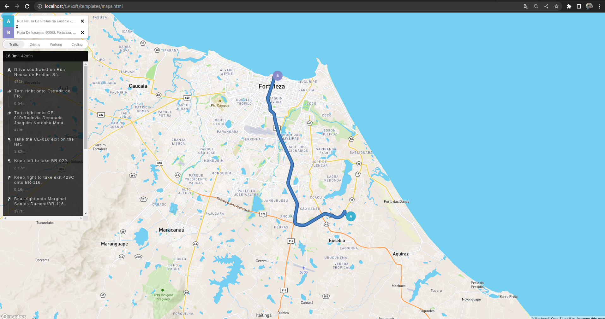

<p align="center">
  </a>
</p>

## Telas do sistema:
<p align="center">
  </a>
</p>
<p align="center">
  </a>
</p>
<p align="center">
  </a>
</p>
<p align="center">
  </a>
</p>

## criando o banco
```bash
docker run --name postgres-db -e POSTGRES_PASSWORD=SUA_SENHA_AQUI -p 5432:5432 -d postgres
```
## Gerando as tabelas
```bash

CREATE TABLE public.tecnico (
	id serial4 NOT NULL,
	nome varchar(30) NOT NULL,
	id_cidade int8 NOT NULL,
	criado_por int8 NULL,
	criado_em timestamp NOT NULL DEFAULT CURRENT_TIMESTAMP,
	nota_media varchar(30) NULL,
	coordenada point NOT NULL,
	alterado_por int8 NULL,
	alterado_em timestamp NULL,
	etag int4 NOT NULL DEFAULT 1,
	CONSTRAINT tecnico_pkey PRIMARY KEY (id)
);

CREATE TABLE public.atendimento (
    id bigint NOT NULL,
    id_tecnico bigint NOT NULL,
    dh_inicio timestamp without time zone,
    dh_termino timestamp without time zone,
    nota numeric(10,2),
    coordenada point NOT NULL,
    criado_por bigint NOT NULL,
    criado_em timestamp without time zone DEFAULT CURRENT_TIMESTAMP NOT NULL,
    alterado_por bigint,
    alterado_em timestamp without time zone,
    etag integer DEFAULT 1 NOT NULL
);

CREATE TABLE public.usuario (
    id bigint NOT NULL,
    nome character varying(100) NOT NULL,
    dh_ultimo_acesso timestamp without time zone NOT NULL,
    criado_por bigint,
    criado_em timestamp without time zone DEFAULT CURRENT_TIMESTAMP NOT NULL,
    alterado_por bigint,
    alterado_em timestamp without time zone,
    etag integer DEFAULT 1 NOT NULL
);

```

## Criando o projeto env
```bash
python3 -m venv projetoCrud
```

## Ativando o projeto
```bash
source bin/activate
```

## instala a conexão com postgre
```bash
pip install psycopg2
```

## instale o flask
```bash
pip install flask
```

## rodar o projeto
```bash
flask run
```

## OBS: Considerações funcionais do back e front:
```bash
1 - O Backend funcionará na porta 5000
2 - O FrontEnd está configurado para rodar na porta default do apache em: 
    http://localhost/GPSoft/
    Caso for mudar para Nginx, ou usar Windows com Xampp, etc... 
    atentar para essas mudanças dos caminhos da pasta assets ok.

TESTANDO:
Para visualizar a aplicação no browser utilize aa rotas: 
http://localhost:5000/login
http://localhost:5000/tecnico
http://localhost:5000/atendimento
http://localhost:5000/consulta
http://localhost:5000/rota

INFO Importante:
Com a implementação de API´s de terceiros, como Google Maps, MapBox, 
dentre outros, não se faz necessário usar uma base de cadastro de 
cidades, UF, etc... pois já temos isso na API que será consumida.

Referências:
https://github.com/googlemaps/google-maps-services-python/blob/master/googlemaps/distance_matrix.py

```

## suporte
```bash
Zap: 85 9 97635122
Mail: geraldo@gpsoft.com.br
```
