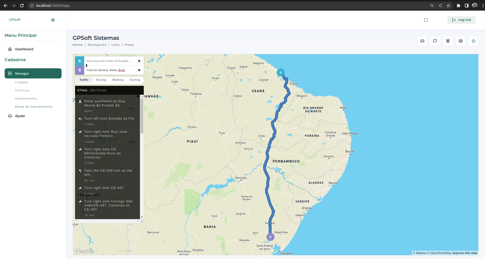

<p align="center">
  </a>
</p>

## Telas do sistema:
<p align="center">
  </a>
</p>
<p align="center">
  </a>
</p>

## criando o banco
```bash
docker run --name postgres-db -e POSTGRES_PASSWORD=SUA_SENHA_AQUI -p 5432:5432 -d postgres
```

## Criando o projeto env
```bash
python3 -m venv projetoCrud
```

## Ativando o projeto
```bash
source bin/activate
```

## instala a conexão com postgre
```bash
pip install psycopg2
```

## instale o flask
```bash
pip install flask
```

## rodar o projeto
```bash
falsk run
```
