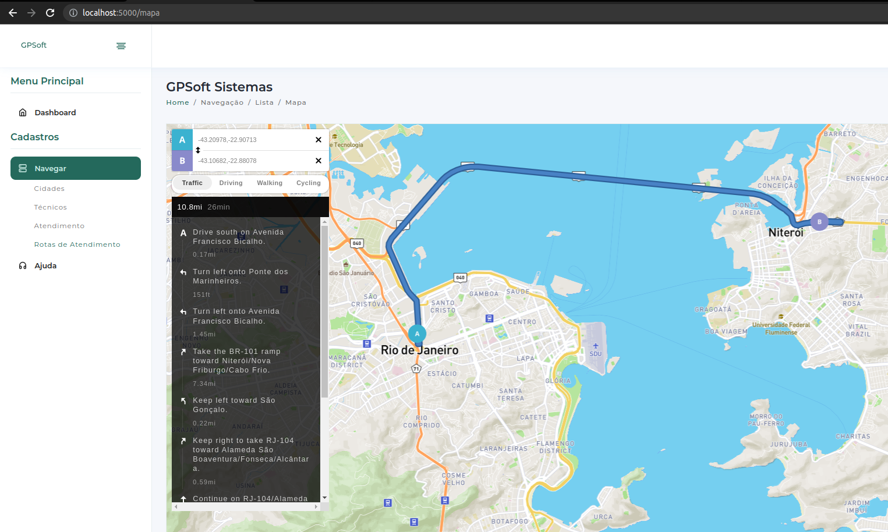
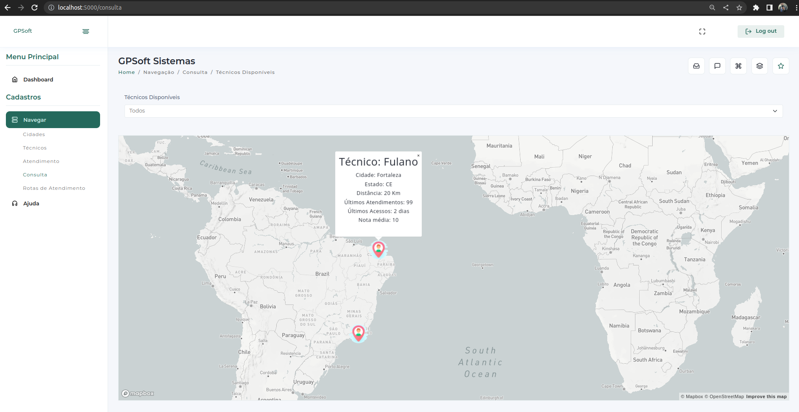

<p align="center">
  </a>
</p>

## Telas do sistema:
<p align="center">
  </a>
</p>
<p align="center">
  </a>
</p>
<p align="center">
  </a>
</p>
<p align="center">
  </a>
</p>
<p align="center">
  </a>
</p>

## criando o banco
```bash
docker run --name postgres-db -e POSTGRES_PASSWORD=SUA_SENHA_AQUI -p 5432:5432 -d postgres
```
## Gerando as tabelas
```bash
CREATE TABLE public.atendimento (
	id int8 NOT NULL,
	id_cliente int8 NOT NULL,
	id_tecnico int8 NOT NULL,
	dt_cad timestamp NOT NULL DEFAULT CURRENT_TIMESTAMP,
	dt_close timestamp NULL,
	descricao varchar(255) NOT NULL,
	nota varchar(4) NULL,
	status varchar(30) NULL,
	CONSTRAINT atendimento_pkey PRIMARY KEY (id)
);

CREATE TABLE public.atendimento_status (
	id int8 NOT NULL,
	descricao varchar(30) NOT NULL,
	CONSTRAINT atendimento_status_pkey PRIMARY KEY (id)
);

CREATE TABLE public.cidade_brasil (
	id serial4 NOT NULL,
	estado varchar(255) NULL,
	nome_estado varchar(255) NULL,
	cidade varchar(255) NULL,
	codigo_cidade varchar(255) NULL,
	codigo_estado varchar(255) NULL,
	população varchar(255) NULL,
	regiao varchar(255) NULL,
	coordenada varchar(255) NULL,
	parceiros varchar(255) NULL,
	criado_por varchar(255) NULL,
	criado_em varchar(255) NULL,
	alterado_por varchar(255) NULL,
	alterado_em varchar(255) NULL,
	etag varchar(255) NULL,
	CONSTRAINT cidade_brasil_pkey PRIMARY KEY (id)
		
CREATE TABLE public.cliente (
	id serial4 NOT NULL,
	id_cidade_brasil int8 NOT NULL,
	nome varchar(50) NULL,
	CONSTRAINT cliente_pkey PRIMARY KEY (id)
);

CREATE TABLE public.tecnico (
	id serial4 NOT NULL,
	id_cidade int8 NOT NULL,
	nome varchar(30) NOT NULL,
	nota_media varchar(30) NULL,
	CONSTRAINT tecnico_pkey PRIMARY KEY (id)
);

CREATE TABLE public.usuario (
	id int8 NOT NULL,
	usuario varchar(20) NOT NULL,
	senha varchar(20) NOT NULL,
	criado_em timestamp NOT NULL DEFAULT CURRENT_TIMESTAMP,
	alterado_em timestamp NOT NULL,
	CONSTRAINT user_pkey PRIMARY KEY (id)
);
 
CREATE OR REPLACE VIEW public.v_consulta
AS SELECT cid.cidade,
    cid.estado,
    count(ate.id) AS atendimentos,
    count(tec.id) AS acessos,
    ate.nota
   FROM atendimento ate,
    tecnico tec,
    cidade_brasil cid
  WHERE cid.id = tec.id_cidade AND tec.id = ate.id_tecnico
  GROUP BY cid.cidade, cid.estado, ate.nota;
  
CREATE OR REPLACE VIEW public.v_atendimento_cidade_cliente
AS select ate.id as cod_atendimento
        , cli.nome as cliente 
        , cb.cidade as cidade
        , cb.nome_estado as estado
        , cb.coordenada
   FROM atendimento ate, cliente cli, cidade_brasil cb
  WHERE ate.id_cliente = cli.id  
    and cli.id_cidade_brasil = cb.id 
    
CREATE OR REPLACE VIEW public.v_tecnico_disponivel
AS select tec.nome as tecnico_disponivel
FROM tecnico tec,
    atendimento ate
  WHERE tec.id = ate.id_tecnico AND ate.status::text <> 'Aberto'
    
```

## Criando o projeto env
```bash
python3 -m venv projetoCrud
```

## Ativando o projeto
```bash
source bin/activate
```

## instala a conexão com postgre
```bash
pip install psycopg2
```

## instale o flask
```bash
pip install flask
```

## rodar o projeto
```bash
flask run
```

## OBS: Considerações funcionais do back e front:
```bash
1 - O Backend funcionará na porta 5000
2 - O FrontEnd está configurado para rodar na porta default do apache em: 
    http://localhost/GPSoft/
    Caso for mudar para Nginx, ou usar Windows com Xampp, etc... 
    atentar para essas mudanças dos caminhos da pasta assets ok.

TESTANDO:
Para visualizar a aplicação no browser utilize aa rotas: 
http://localhost:5000/login
http://localhost:5000/usuarios
http://localhost:5000/tecnicos
http://localhost:5000/atendimento
http://localhost:5000/consulta
http://localhost:5000/rota

INFO Importante:
Com a implementação de API´s de terceiros, como Google Maps, MapBox, 
dentre outros, não se faz necessário usar uma base de cadastro de 
cidades, UF, etc... pois já temos isso na API que será consumida.

Referências:
MapBox:
https://docs.mapbox.com/api/navigation/matrix/
https://docs.mapbox.com/help/glossary/matrix-api/
https://blog.mapbox.com/distance-api-launches-e8f2c3a6fb61

Google Maps:
https://developers.google.com/maps/documentation/distance-matrix/overview?hl=pt-br
https://github.com/googlemaps/google-maps-services-python/blob/master/googlemaps/distance_matrix.py

```

## Video Demo
<a href="https://youtu.be/nxQtojEeT3E" target="_blank">Clique Aqui</a>

## suporte
```bash
WhatsApp: (85) 9 9150-8104
Mail: geraldo@gpsoft.com.br
```
